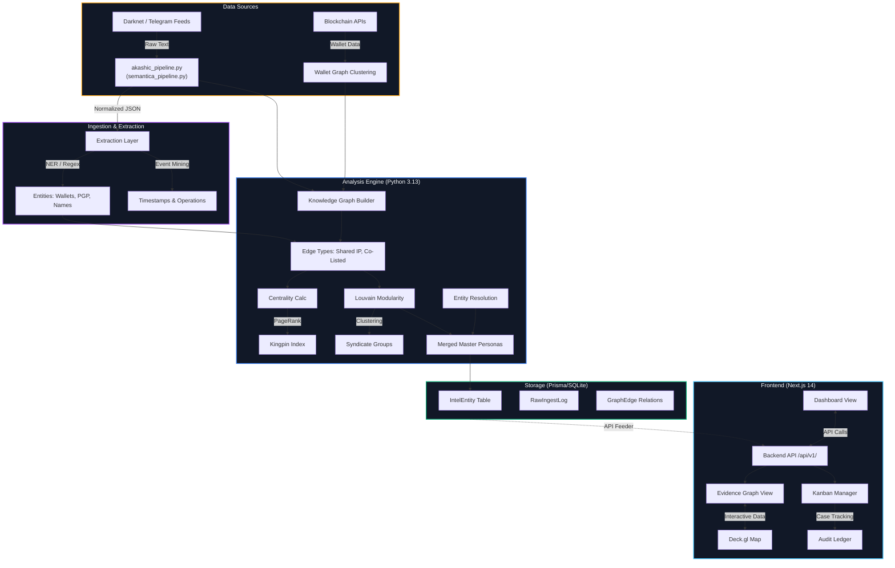

# 🌌 PROJECT A.K.A.S.H.I.C. (आकाशिक) — AI-Powered Darknet Cybercrime & Forensic Intelligence Platform

> **A.K.A.S.H.I.C. (Autonomous Knowledge-base for Anti-narcotics, Syndicate Hotspots & Inter-agency Cyber-forensics)**  
> *Deterministic Context Graph Engine, Cross-Source Entity Resolution, GPU Geospatial Supply Chain Corridors, and Tamper-Evident Forensic Dossier Automation.*  
> *Developed for Law Enforcement, Anti-Narcotics Task Forces, and Intelligence Agencies.*

---

[](https://nextjs.org/)
[](https://www.python.org/)
[](https://github.com/semantica-agi/semantica)
[](https://deck.gl/)
[](https://www.typescriptlang.org/)
[](https://vitest.dev/)
[](https://github.com/Poison714bro/PROJECT-A.K.A.S.H.I.C)

---

## 📑 Table of Contents

- [1. Executive Overview & Problem Statement](#1-executive-overview--problem-statement)
- [2. System Architecture & Operational Workflow](#2-system-architecture--operational-workflow)
  - [2.1 End-to-End Operational Pipeline Diagram](#21-end-to-end-operational-pipeline-diagram)
  - [2.2 Data Sources & Dual-Channel Pipeline Ingestion](#22-data-sources--dual-channel-pipeline-ingestion)
  - [2.3 Ingestion & Extraction Layer (NER, Regex & Event Mining)](#23-ingestion--extraction-layer-ner-regex--event-mining)
  - [2.4 Analysis Engine: Graph Builder, Centrality & Louvain Syndicates](#24-analysis-engine-graph-builder-centrality--louvain-syndicates)
  - [2.5 Storage Layer (Prisma / SQLite Relational Models)](#25-storage-layer-prisma--sqlite-relational-models)
  - [2.6 Real-Time Operator Interface (Next.js 14 & Deck.gl 9)](#26-real-time-operator-interface-nextjs-14--deckgl-9)
- [3. Core Operational Modules](#3-core-operational-modules)
  - [3.1 Executive Command Center](#31-executive-command-center)
  - [3.2 Entity Resolution Engine & Syndicate Matrix](#32-entity-resolution-engine--syndicate-matrix)
  - [3.3 Evidence Graph & Neural Physics Simulation](#33-evidence-graph--neural-physics-simulation)
  - [3.4 Geospatial Supply Chain Corridors (Deck.gl 9)](#34-geospatial-supply-chain-corridors-deckgl-9)
  - [3.5 Forensic Case Management & Tamper-Evident Ledger](#35-forensic-case-management--tamper-evident-ledger)
  - [3.6 Pattern of Life & Darknet Triplet Mining Studio](#36-pattern-of-life--darknet-triplet-mining-studio)
- [4. Technology Stack](#4-technology-stack)
- [5. Project Directory Structure](#5-project-directory-structure)
- [6. API Architecture & Endpoint Reference](#6-api-architecture--endpoint-reference)
- [7. Installation & Quickstart Guide](#7-installation--quickstart-guide)
- [8. Test Suites & Verification](#8-test-suites--verification)
- [9. Forensic Standards & Court-Admissibility Compliance](#9-forensic-standards--court-admissibility-compliance)
- [10. Contributors & License](#10-contributors--license)

---

## 1. Executive Overview & Problem Statement

Modern cyber-narcotics cartels and darknet threat syndicates operate across distributed, anonymized topologies:
- **Burner Personas & Aliases**: Operators hop between Dread, Telegram channels, Wickr handles, and darknet forums.
- **Crypto Obfuscation**: Illicit revenue is laundered through Peel Chains, CoinJoins, ChipMixer relays, and cross-chain Monero bridges.
- **Fragmented Logistics**: Raw fentanyl precursors and synthetic stimulants travel across transnational shipping routes before street-level distribution.
- **Conflicting Source Intelligence**: Wiretaps, informant testimonies, and intercepted comms frequently contradict each other.
- **Court Admissibility Challenges**: Raw intelligence must be transformed into tamper-evident, Section 65B-compliant forensic dossier packages with cryptographic chain of custody.

### 🎯 What A.K.A.S.H.I.C. Solves
**PROJECT A.K.A.S.H.I.C.** is an end-to-end intelligence operating system combining a deterministic **Semantica ContextGraph** engine with **GPU-accelerated geospatial tracking**, **heuristic link prediction**, **credibility-weighted contradiction arbitration**, and **SHA-256 audit chaining** to empower law enforcement investigators from initial darknet scrapings to court conviction.

---

## 2. System Architecture & Operational Workflow

The A.K.A.S.H.I.C. platform operates across a five-tier architecture: **Data Sources**, **Ingestion & Extraction**, **Analysis Engine (Python 3.13)**, **Storage (Prisma/SQLite)**, and the **Frontend Operator Interface (Next.js 14)**.

### 2.1 End-to-End Operational Pipeline Diagram



---

### 2.2 Data Sources & Dual-Channel Pipeline Ingestion
1. **Unstructured Communications & Posts**:
   - **Darknet & Telegram Feeds**: Streams vendor listings, escrow chatter, and channel dumps as **Raw Text**.
2. **On-Chain Financial Forensics**:
   - **Blockchain APIs**: Streams **Wallet Data** across Bitcoin, Monero, and Ethereum nodes.
   - **Wallet Graph Clustering**: Clusters co-spent inputs, change addresses, and mixer transactions, directly feeding clustered transaction subgraphs into the **Knowledge Graph Builder**.
3. **Automated Pipeline (`akashic_pipeline.py` / `semantica_pipeline.py`)**:
   - Ingests raw feeds, cleans transport noise, and produces standardized **Normalized JSON** dispatched to the **Extraction Layer** and **Knowledge Graph Builder**.

---

### 2.3 Ingestion & Extraction Layer (NER, Regex & Event Mining)
1. **Extraction Layer**:
   - Processes normalized payloads through dedicated cybercrime parsers:
   - **NER / Regex**: Extracts high-value forensic IOCs into **Entities: Wallets, PGP, Names** (Bitcoin Bech32/P2PKH, XMR subaddresses, 40-char PGP fingerprints, Telegram `@handles`).
   - **Event Mining**: Extracts temporal operational milestones into **Timestamps & Operations** (dispatch schedules, drop confirmations, vendor listing active windows).

---

### 2.4 Analysis Engine: Graph Builder, Centrality & Louvain Syndicates
1. **Knowledge Graph Builder**:
   - Constructs deterministic multi-target RDF ContextGraphs from pipeline feeds and binds extracted entities.
2. **Edge Classification (`Edge Types: Shared IP, Co-Listed`)**:
   - Resolves infrastructure ties including shared Tor exit relays, co-listed marketplace vendor accounts, and common cryptocurrency counter-parties.
3. **Kingpin Index Identification**:
   - **Centrality Calc** computes composite **Kingpin Index** ($0.5 \times \text{PageRank} + 0.5 \times \text{Betweenness Centrality}$) to differentiate kingpins from mid-level runners.
4. **Criminal Syndicate Clustering**:
   - **Louvain Modularity** partitions the graph into dense community clusters (**Syndicate Groups**).
5. **Entity Resolution & Persona Merging**:
   - Merges candidate personas with cryptographic collisions (shared PGP keys / wallets) and high Jaccard/Levenshtein text similarity into **Merged Master Personas**.

---

### 2.5 Storage Layer (Prisma / SQLite Relational Models)
1. **Relational Schema Structure**:
   - **`IntelEntity Table`**: Persists verified Master Personas, risk scores, aliases, and operational status.
   - **`RawIngestLog`**: Complete audit trail of ingested posts, timestamps, source channels, and raw payloads.
   - **`GraphEdge Relations`**: Persists relational links, co-conspiracy weights, and evidence references.

---

### 2.6 Real-Time Operator Interface (Next.js 14 & Deck.gl 9)
1. **Executive Command Center (`Dashboard View`)**:
   - Communicates bi-directionally via **API Calls** (`/api/v1/`) to stream real-time KPIs, threat feeds, and seizure statistics.
2. **Tactical Investigation Hub**:
   - **Evidence Graph View**: 60 FPS Canvas2D force-directed simulation visualizing network topologies and money laundering flow routes.
   - **Deck.gl Map**: Hardware-accelerated 3D geospatial layer rendering transit arcs, seizure scatterplots, and supply chain heatmaps, synced with **Interactive Data** from the evidence graph.
3. **Forensic Case Pipeline**:
   - **Kanban Manager**: Drag-and-drop case tracking across investigative stages.
   - **Audit Ledger**: Cryptographic SHA-256 Merkle chain providing court-admissible Section 65B audit trails for every investigative action.

---

## 3. Core Operational Modules

### 3.1 Executive Command Center
- **High-Level KPI Dashboards**: Real-time counters for active syndicate targets, seized contraband volumes (kg), monitored cryptocurrency wallets, and active interdiction ops.
- **Threat Activity Feed**: Streaming, live threat ticker updating investigators on high-priority network events, suspicious crypto movements, and intercepted transmissions.
- **Multi-Vector Threat Matrix**: Radar and bar breakdown classifying threats by narcotics type (Fentanyl, Methamphetamine, MDMA, Synthetic Cannabinoids) and operational vector.

---

### 3.2 Entity Resolution Engine & Syndicate Matrix
- **Automated Duplicate Persona Queue**: Uses weighted Jaccard similarity, Levenshtein distance, and deterministic cryptographic matches (shared Bitcoin/Monero addresses, identical PGP public key fingerprints) to score persona matches.
- **Cartels & Syndicates Matrix**: Native Louvain Modularity clustering algorithm in NetworkX/Semantica that groups isolated suspect nodes into criminal gangs with intra-cluster density scoring.
- **Kingpin & Broker Matrix**: Identifies criminal bosses vs. transactional brokers using composite **Kingpin Index** ($0.5 \times \text{PageRank} + 0.5 \times \text{Betweenness Centrality}$).
- **Multi-Spectral Forensic Image Loupe**: Interactive hover-loupe inspecting seized physical contraband and digital scales, with simulated YOLO bounding boxes ($0.98$ confidence, $0.89\text{ IoU}$).

---

### 3.3 Evidence Graph & Neural Physics Simulation
- **60 FPS Force-Directed Canvas**: Built with `react-force-graph-2d` and HTML5 Canvas2D rendering. Features dynamic node collision padding, adaptive alpha/velocity decays, and zoom-aware label culling.
- **Directional Particle Flow Pathways**:
  - **Financial Vectors (Yellow)**: Directional particle flow along crypto transactions and bank wires.
  - **Communication Channels (Cyan)**: Particle streams showing Telegram, Session, and Wickr chatter.
  - **Infrastructure Ties (Indigo)**: Server hosting, shared dropboxes, and PGP signatures.
- **Laundering Flow Route Tracer**: Multi-hop Dijkstra shortest-path engine tracing clean funds through mixer relays and Monero hops to destination cash-out wallets.
- **Covert Link Predictor**: Heuristic link prediction engine detecting hidden ties between conspirators based on shared infrastructure and common financial counter-parties.

---

### 3.4 Geospatial Supply Chain Corridors (Leaflet.js & Deck.gl 9)
- **Interactive Leaflet.js Map Investigation Canvas**:
  - High-responsiveness geospatial canvas rendering geo-referenced suspect nodes, Inferred Geo-Hints (`Lat/Lng`), and border checkpoints.
  - Interactive marker clustering and tactical overlays styled dynamically from the **Visual Metadata Object** (Hex color tagging layer).
- **High-Density GPU Geospatial Layers (Deck.gl 9)**:
  - `ScatterplotLayer`: Renders individual seizure incidents and drug lab locations color-coded by drug category.
  - `ArcLayer`: Renders 3D arcs mapping transnational supply logistics from source synthesis labs to regional distribution nodes.
  - `PathLayer`: Displays multi-waypoint transit corridors with dashed animated styles based on the **Route Availability Prediction Model**.
  - `HeatmapLayer`: Real-time seizure density heatmaps across cities and border zones derived from **10-Year Historical Timestamp Series Analysis**.
- **Supercluster Integration**: Hardware-accelerated client-side point clustering scaling up to 10,000+ simultaneous map pins.
- **Temporal Playback Slider**: Interactive timeline scrubbing showing the temporal progression of smuggling routes over time.

---

### 3.5 Forensic Case Management & Tamper-Evident Ledger
- **Kanban Case Pipeline**: Drag-and-drop investigation workflow powered by `@dnd-kit/core` and `@dnd-kit/sortable` with persistent state tracking.
- **Time-Bounded AI Digests & LLM Summaries**: Automated generation of chronological case chronologies and tactical threat summaries bounded by investigator-defined date ranges.
- **Contradiction Resolver**: Detects contradictory statements between multiple human informants or surveillance logs and arbitrates using credibility-weighted scoring:
  $$\text{Score}(v) = \sum_{c \in \text{Claims}(v)} \text{Credibility}(c.\text{source}) \times \text{Weight}(c.\text{type})$$
- **Tamper-Evident SHA-256 Chain**: Cryptographic audit ledger where every investigative decision (persona merge, dispute resolution, evidence tag) is hashed with the previous block's SHA-256 hash.
- **Court Case Dossier Builder**: Generates standardized, formatted Law Enforcement Markdown dossiers citing evidentiary chains, IOC lists, and verified forensic audit logs.

---

### 3.6 Pattern of Life & Darknet Triplet Mining Studio
- **Composite Temporal Histograms**: Dual-axis Recharts visualizing communication frequencies, transaction volumes, and darknet vendor post spikes.
- **Cybercrime Named Entity Recognition (NER) & Slang Classifier**: Regex, NLP & heuristic miners extracting:
  - Bitcoin (Bech32, P2PKH, P2SH) & Monero (XMR) addresses
  - 40-character PGP key fingerprints
  - Telegram handles (`@username`) and Tor v3 `.onion` URLs
  - Illicit substances (Fentanyl, Oxycodone, MDMA, Meth, Cocaine, Precursor chemicals)
- **One-Click ContextGraph Ingestion**: Ingests mined RDF Triplets (`Subject -[Predicate]-> Object`) directly into the active Semantica knowledge graph backend.

---

## 4. Technology Stack

### 💻 Frontend & Client UI
| Library / Framework | Version | Purpose |
| :--- | :---: | :--- |
| **Next.js** | `14.2.35` | App Router, SSR & Production Bundling |
| **React** | `18.3.1` | Component Architecture & State Hooks |
| **TypeScript** | `5.9.3` | Strict Static Typing & Schema Definitions |
| **TailwindCSS** | `3.4.19` | Cyberpunk Dark Mode & Glassmorphism Design System |
| **Leaflet.js / React-Leaflet** | `1.9.4` | Interactive Geo-Hint & Tactical Map Hub |
| **Deck.gl** | `9.3.11` | GPU-Accelerated WebGL Geospatial Data Layers |
| **MapLibre GL** | `6.6.0` | High-Resolution Vector Basemap Renderer |
| **react-force-graph-2d** | `1.29.1` | D3-Powered Particle Physics Knowledge Graph |
| **Recharts** | `2.15.4` | Composed Timeline & Temporal Histograms |
| **Framer Motion** | `11.18.2` | Smooth Micro-Interactions, Drawers & Lightboxes |
| **@dnd-kit** | `6.3.1` | Hardware-Accelerated Drag and Drop Kanban Board |
| **Zustand** | `5.0.15` | Global State Management & Entity Cross-Selection |
| **Lucide React** | `0.400.0` | Vector Iconography System |

### 🐍 Backend & Analytical Engines
| Component / Library | Version | Purpose |
| :--- | :---: | :--- |
| **Python** | `3.13.2 (64-bit)` | Core High-Performance Analytical Runtime |
| **Semantica AGI** | `0.6.7` | Deterministic ContextGraph & Entity Ingestion |
| **NetworkX** | `3.6.1` | Graph Analytics, Louvain Clustering & Centrality |
| **NumPy** | `2.5.2` | Vectorized Linear Algebra & Matrix Math |
| **Pydantic** | `2.13.5` | Strict Python Data Schema Validation |
| **Prisma ORM** | `5.22.0` | Database Modeling & Schema Migrations |
| **Express / CORS** | `5.2.1 / 2.8.6` | Lightweight Auxiliary API Dispatch |
| **Darknet Intel MCP** | `v2.0` | Model Context Protocol OSINT & Stylometry Server |

---

## 5. Project Directory Structure

```
PROJECT-A.K.A.S.H.I.C/
├── analysis/                              # Python 3.13 Semantica Analytics Microservices
│   ├── conflicts/                         # Contradiction Detection & Arbitration
│   │   ├── conflict_detector.py           # Multi-source claim collision detector
│   │   ├── conflict_resolver.py           # Credibility-weighted arbitration
│   │   └── source_tracker.py              # Source reliability rating engine
│   ├── exporters/                         # Dossier & External Graph Exporters
│   │   ├── dossier_exporter.py            # Law Enforcement Markdown generator
│   │   └── graph_exporter.py              # Neo4j Cypher & Gephi GEXF formatters
│   ├── extraction/                        # Cybercrime NER & Triplet Parsing
│   │   ├── event_detector.py              # Operational timestamp event miner
│   │   ├── ner.py                         # Crypto wallet, PGP, Telegram extractor
│   │   └── triplet_extractor.py           # Subject-Predicate-Object RDF miner
│   ├── kg/                                # Knowledge Graph Algorithms
│   │   ├── centrality_calculator.py       # PageRank & Betweenness (Kingpin Index)
│   │   ├── community_detector.py          # Louvain Modularity syndicate clustering
│   │   ├── link_predictor.py              # Heuristic co-conspiracy link predictor
│   │   ├── path_finder.py                 # Dijkstra money laundering flow tracer
│   │   └── temporal_reasoning.py          # Time-bounded relationship analysis
│   ├── provenance/                        # Cryptographic Chain of Custody
│   │   ├── chain_of_custody.py            # Evidence custody timeline tracker
│   │   └── decision_recorder.py           # SHA-256 tamper-evident ledger
│   ├── resolution/                        # Entity Resolution Engine
│   │   ├── duplicate_detector.py          # Persona candidate matching
│   │   ├── entity_merger.py               # Master entity unification
│   │   └── similarity.py                  # Jaccard & Levenshtein calculators
│   ├── akashic_entity_resolver.py         # High-level Entity Resolution Service
│   └── akashic_graph_service.py           # High-level ContextGraph Manager
├── ingestion/                             # Data Ingestion Pipelines
│   └── akashic_pipeline.py                # Raw feed parsing and GraphBuilder feeder
├── src/                                   # Next.js 14 Frontend Application
│   ├── app/                               # Next.js App Router & API Endpoints
│   │   ├── api/v1/                        # RESTful Typed API Route Handlers
│   │   │   ├── dashboard/                 # KPIs, charts, and threat feeds
│   │   │   ├── graph/                     # Topology and analytics
│   │   │   ├── ingest/                    # Raw text ingestion pipeline
│   │   │   ├── intelligence/              # Conflicts, audit, dossier, triplets
│   │   │   ├── investigations/            # Kanban case cards
│   │   │   ├── map/                       # Geospatial pins & routes
│   │   │   ├── network/default/           # Live Python 3.13 A.K.A.S.H.I.C. graph endpoint
│   │   │   └── search/                    # Global omni-search
│   │   ├── globals.css                    # TailwindCSS theme tokens
│   │   ├── layout.tsx                     # Root application layout
│   │   └── page.tsx                       # Single-page multi-view app container
│   ├── components/                        # Modular React Components
│   │   ├── dashboard/                     # Executive Command Center widgets
│   │   ├── layout/                        # Sidebar, Navigation, Top Bar
│   │   ├── ui/                            # Buttons, Modals, Badges, SearchInput
│   │   └── views/                         # Primary Operational Views
│   │       ├── EntityResolution.tsx       # Personas, Loupe, Cartels & Kingpin Matrix
│   │       ├── EvidenceGraph.tsx          # Force Graph, Flow Tracer & Link Predictor
│   │       ├── InvestigationManager.tsx   # Kanban, Contradiction Resolver & Audit Ledger
│   │       ├── MapView.tsx                # Deck.gl 9 Geospatial Corridors
│   │       └── TimelineReconstructor.tsx  # Histograms & Darknet Triplet Studio
│   ├── hooks/                             # Custom React State & Data Hooks
│   │   ├── useDashboardData.ts            # Executive stats & feed hook
│   │   ├── useKanbanBoard.ts              # Drag-and-drop board state hook
│   │   └── useMapData.ts                  # Deck.gl clustering & date filter hook
│   ├── lib/                               # Core Utilities & State Stores
│   │   ├── apiClient.ts                   # Centralized typed API client
│   │   ├── graphAnalytics.ts              # Client-side centrality & path algorithms
│   │   ├── mockData.ts                    # Seed intelligence records & POIs
│   │   └── store.ts                       # Zustand global application store
│   └── test/                              # Vitest Test Setup
│       └── setup.ts                       # Jest-DOM matchers initialization
├── test_akashic_engine.py                 # Unit Test Suite for A.K.A.S.H.I.C. Graph Engine
├── test_akashic_integration.py            # 10-Step Forensic Integration Test Suite
├── vitest.config.mts                      # Memory-Efficient Vitest Configuration
├── tsconfig.json                          # TypeScript Compiler Settings
└── package.json                           # NPM Dependencies & Scripts
```

---

## 6. API Architecture & Endpoint Reference

All endpoints are strictly typed via TypeScript and return standardized JSON envelopes (`{ ok: boolean, data?: any, error?: string }`):

| Method | Endpoint | Description | Key Query / Body Params |
| :--- | :--- | :--- | :--- |
| `GET` | `/api/v1/network/default` | Returns live Semantica ContextGraph topology & metrics | None |
| `GET` | `/api/v1/graph/analytics` | Calculates Kingpin indices & shortest path flow | `?source=ent-001&target=ent-002` |
| `POST` | `/api/v1/ingest/pipeline` | Ingests unstructured text feed into graph | `{ text: string, source: string }` |
| `POST` | `/api/v1/intelligence/triplets` | Extracts RDF triplets & cyber indicators from text | `{ text: string }` |
| `GET` | `/api/v1/intelligence/conflicts` | Lists all detected intelligence contradictions | None |
| `POST` | `/api/v1/intelligence/conflicts` | Resolves contradiction using chosen strategy | `{ conflictId, chosenValue, strategy, justification }` |
| `GET` | `/api/v1/intelligence/audit` | Retrieves immutable SHA-256 audit ledger | None |
| `POST` | `/api/v1/intelligence/audit` | Records new tamper-evident forensic decision | `{ decisionType, targetEntityId, action, justification, officerId }` |
| `POST` | `/api/v1/intelligence/dossier` | Generates formatted Law Enforcement Markdown dossier | `{ targetId: string }` |
| `GET` | `/api/v1/intelligence/alias-matches` | Lists duplicate persona candidates with scores | None |
| `POST` | `/api/v1/intelligence/merge-aliases` | Merges secondary persona into master entity | `{ primaryId, secondaryId, reason }` |
| `POST` | `/api/v1/intelligence/osint/resolve` | Resolves IP/Whois and correlates Tor exit node DBs | `{ handleOrIp: string }` |
| `POST` | `/api/v1/intelligence/crypto/cluster` | Clusters blockchain wallets and infers geo-hints (`Lat/Lng`) | `{ addresses: string[] }` |
| `POST` | `/api/v1/intelligence/routes/predict` | Predicts contraband transit corridors from 10-yr hotspots | `{ origin, destination, drugType }` |
| `POST` | `/api/v1/intelligence/summarize` | Generates time-bounded LLM situational threat digests | `{ timeWindow: string, entityIds?: string[] }` |
| `GET` | `/api/v1/map/pins` | Retrieves geo-located drug seizure incidents | `?startDate=...&endDate=...&drugCategory=...` |
| `GET` | `/api/v1/dashboard/kpis` | Returns executive threat statistics & counts | None |
| `GET` | `/api/v1/dashboard/feed` | Streaming threat notifications & alert ticker | `?limit=12` |
| `GET` | `/api/v1/investigations` | Returns Kanban case cards grouped by stage | None |
| `GET` | `/api/v1/search` | Global omni-search across all entities & cases | `?q=searchQuery` |

---

## 7. Installation & Quickstart Guide

### 📋 Prerequisites
- **Node.js**: `v18.18.0` or higher
- **Python**: `v3.13.0` or higher (64-bit)
- **Git**: Installed and configured

### 🚀 Step 1: Clone Repository & Install Node Dependencies
```bash
# Clone the repository
git clone https://github.com/Poison714bro/PROJECT-A.K.A.S.H.I.C.git
cd PROJECT-A.K.A.S.H.I.C

# Install frontend dependencies
npm install
```

### 🐍 Step 2: Configure Python 3.13 Environment & Semantica
```bash
# Ensure Python 3.13 is active
python --version

# Install Python requirements
pip install networkx numpy pydantic pytest python-dotenv setuptools wheel

# Install Semantica in editable mode (from sibling directory or repository)
pip install -e "d:/git uploads/semantica" --no-deps
```

### ⚙️ Step 3: Configure Environment Variables
Create a `.env.local` file in the root directory:
```env
NEXT_PUBLIC_APP_NAME="PROJECT A.K.A.S.H.I.C. Forensic Intelligence Platform"
NEXT_PUBLIC_APP_VERSION="1.0.0"
PYTHON_BIN_PATH="C:/Users/Pushkar/AppData/Local/Programs/Python/Python313/python.exe"
```

### 💻 Step 4: Run Development Server
```bash
npm run dev
```
Open your browser and navigate to **[http://localhost:3000](http://localhost:3000)**.

---

## 8. Test Suites & Verification

The platform maintains a **100% test pass rate** across frontend unit tests, Python engine algorithms, and full forensic pipeline integrations.

### 🧪 1. Frontend Unit Tests (Vitest)
```bash
npm run test
```
- **Tests Executed**: **57 / 57 Passed** across 14 test suites in **~3.3s**.
- **Coverage**: Store state transitions, auth handlers, Kanban drag-and-drop, date filters, map clustering, and search debounce.

### 🐍 2. A.K.A.S.H.I.C. Engine Unit Tests
```bash
python test_akashic_engine.py
```
- **Tests Executed**: **6 / 6 Passed** in **0.284s**.
- **Coverage**: ContextGraph initialization, Kingpin Index calculation, JSON serialization, Dijkstra laundering tracer, automated ingestion pipeline, and entity resolution duplicate detector.

### 🛡️ 3. Forensic Suite Integration Tests
```bash
python test_akashic_integration.py
```
- **Suites Executed**: **10 / 10 Passed**.
- **Coverage**:
  1. Multi-Target Knowledge Graph Construction
  2. Louvain Criminal Syndicate Detection
  3. Kingpin Identification (PageRank / Betweenness)
  4. Money Laundering Flow Route Tracer
  5. Link Prediction (Hidden Criminal Ties)
  6. Suspect Entity Resolution (DarkPhoenix_77 vs Ph03nix_Rx)
  7. Contradictory Intelligence & Source Reliability Engine
  8. Decision Audit Trail & Tamper-Evident SHA-256 Chain
  9. Court Dossier & Neo4j Cypher Graph Exporters
  10. Cybercrime NER & RDF Triplet Mining

### 📦 4. Production Build Verification
```bash
npm run build
```
- **Output**: **`✓ 24 / 24 pages & API endpoints compiled`** with 0 TypeScript and 0 ESLint errors.

---

## 9. Forensic Standards & Court-Admissibility Compliance

```
┌────────────────────────────────────────────────────────────────────────┐
│               FORENSIC EVIDENCE INTEGRITY LEDGER                       │
├───────────────────┬────────────────────────────────────────────────────┤
│ Hashing Standard  │ SHA-256 Cryptographic Block Chaining               │
├───────────────────┼────────────────────────────────────────────────────┤
│ Legal Compliance  │ Section 65B (Indian Evidence Act / BSA) Ready      │
├───────────────────┼────────────────────────────────────────────────────┤
│ Chain of Custody  │ Immutable Officer ID, Timestamp & Justification    │
├───────────────────┼────────────────────────────────────────────────────┤
│ Graph Export      │ Cypher Statements (Neo4j) & Standard RDF (Turtle) │
└───────────────────┴────────────────────────────────────────────────────┘
```

1. **Deterministic Arbitration**: No black-box hallucinations. All dispute resolutions explicitly cite source reliability scores and mathematical weightings.
2. **Cryptographic Proof of Non-Tampering**: Each investigative entry calculates a SHA-256 digest over `[prevHash + timestamp + officerId + action + payload]`, making retroactive modification mathematically impossible without invalidating the chain.
3. **Reproducible Graph Geometry**: All force graph states, Louvain community partitions, and shortest paths are fully deterministic given a seed entity graph.

---

## 10. Contributors & License

- **Project Identity**: PROJECT A.K.A.S.H.I.C. — Autonomous Knowledge-base for Anti-narcotics, Syndicate Hotspots & Inter-agency Cyber-forensics
- **Architecture & Lead Development**: Code Blooded
- **Knowledge Graph Framework**: Powered by [Semantica AGI](https://github.com/semantica-agi/semantica)
- **License**: MIT License — Open for Law Enforcement & Academic Research

---

<p align="center">
  <b>PROJECT A.K.A.S.H.I.C. — PROVING TRUTH THROUGH STRUCTURED GRAPH FORENSICS</b>
</p>
